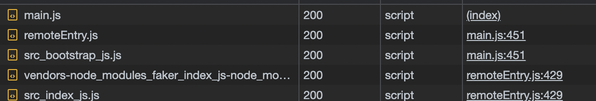

This is a learning project that follows this tutorial on [microfrontend](https://www.udemy.com/course/microfrontend-course/)

## Types of files generated by webpack:

main.js - created on normal build, allows running project standalone 

remoteEntry.js - generated by MFP, list of files available from project and loading instructions 

src_index.js - a processed version of index.js + dependencies ( that can be run in the browser)

vendors...faker.js - a processed version of faker lib ( that can be run in the browser)

## Project structure

- index.js and bootstrap.js are both required it allows webpack to load dependencies before executing the code (inside bootstrap.js)
- shared in webpack is used to define the shared dependencies; 
  - webpack will only once the package if they have the same major version 
  - for situations when we want to load the package only once in any situation, we use 'singleton: true'. 
  - with 'singleton: true' if the versions are different this error will be displayed:
  